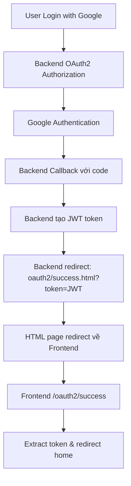

# 🔐 OAuth2 Setup Guide - EasyMart

## 📋 Tổng quan

Dự án EasyMart đã được cập nhật để sử dụng OAuth2 backend thực tế theo các API endpoints từ file HTML test OAuth2 mà bạn cung cấp. Tất cả các API calls đã được tích hợp với backend OAuth2 và hỗ trợ:

- ✅ **Demo Login**: Tài khoản demo `demo@easymart.vn`
- ✅ **Google OAuth2**: Đăng nhập và đăng ký với Google
- ✅ **API Integration**: Sử dụng đúng endpoints từ backend
- ✅ **Error Handling**: Xử lý lỗi và redirect thông minh

## 🚀 Cấu hình nhanh

### 1. Cấu hình Environment Variables

Tạo file `.env` trong thư mục gốc của dự án:

```env
# API Configuration
VITE_API_BASE_URL=http://localhost:8080

# Google OAuth2 Configuration
VITE_GOOGLE_CLIENT_ID=your-google-client-id-here

# Development Configuration
VITE_APP_TITLE=EasyMart - Mini Supermarket
VITE_APP_DESCRIPTION=Ứng dụng mua sắm trực tuyến
```

### 1.1. OAuth2 Redirect URI Configuration

**Quan trọng**: Trong Google Cloud Console, bạn cần cấu hình redirect URI đúng với backend của bạn, KHÔNG phải frontend:

```
http://localhost:8080/login/oauth2/code/google
http://your-backend-domain.com/login/oauth2/code/google
```

**Lưu ý**: 
- Frontend sẽ redirect tới `/oauth2/authorization/google` của backend
- Backend xử lý OAuth2 flow và redirect về frontend với `code` parameter
- Frontend detect `code` và gọi API để lấy user info + JWT token

### 2. Cấu hình Google OAuth2

1. Truy cập [Google Cloud Console](https://console.cloud.google.com/)
2. Tạo project mới hoặc chọn project hiện có
3. Enable Google+ API
4. Tạo OAuth2 credentials
5. Thêm domain của bạn vào Authorized JavaScript origins
6. Copy Client ID và cập nhật vào `VITE_GOOGLE_CLIENT_ID`

### 3. Cấu hình Backend 

#### 3.1. Backend OAuth2 Redirect Configuration

**QUAN TRỌNG**: Backend cần cấu hình để redirect về frontend sau khi OAuth2 thành công. Thêm vào `application.properties` hoặc `application.yml`:

```properties
# OAuth2 Success Redirect (Frontend URL)
oauth2.success.redirect-uri=http://localhost:3000/oauth2/success
oauth2.failure.redirect-uri=http://localhost:3000/login?error=oauth2_failed

# Development
spring.security.oauth2.client.registration.google.redirect-uri=http://localhost:8080/login/oauth2/code/google
```

#### 3.2. Backend Endpoints 

Đảm bảo backend của bạn có các endpoint sau:

#### OAuth2 Endpoints
- `GET /api/oauth2/test-config` - Test cấu hình OAuth2
- `GET /api/oauth2/user-info` - Lấy thông tin user
- `GET /api/oauth2/analyze` - Phân tích user data
- `GET /api/oauth2/check-email` - Kiểm tra email duplicate
- `GET /api/oauth2/check-sub` - Kiểm tra OAuth2 sub
- `GET /api/oauth2/get-token` - Lấy JWT token
- `POST /api/oauth2/callback/google` - Google callback
- `POST /api/oauth2/register/google` - Đăng ký với Google

#### Authentication Endpoints
- `POST /api/auth/login` - Đăng nhập truyền thống
- `POST /api/auth/register` - Đăng ký truyền thống
- `POST /api/auth/logout` - Đăng xuất

## 🔧 API Integration

### Các file đã được cập nhật theo API từ HTML test:

1. **`src/composables/useAuth.js`** ✅
   - Sử dụng demo account `demo@easymart.vn` như trong HTML test
   - Google OAuth2 flow với email/sub validation
   - Tích hợp JWT token từ `/api/oauth2/get-token`
   - Functions: `testOAuth2Config`, `checkEmailDuplicate`, `checkOAuth2Sub`
   - Smart registration/login handling

2. **`src/components/GoogleSignIn.vue`** ✅
   - Enhanced Google credential validation
   - Decode JWT và validate required fields
   - Emit user info với email_verified status
   - Better error handling

3. **`src/views/Login.vue`** ✅
   - Handle needsRegistration từ Google login
   - Auto-redirect tới Register page với pending credential
   - Support demo account login
   - Improved error messages

4. **`src/views/Register.vue`** ✅
   - Auto-handle pending Google registration từ Login page
   - Pre-fill form với Google user info
   - Auto-register flow với sessionStorage
   - URL parameter handling (`?google=pending`)

5. **`src/config/api.js`** ✅
   - Updated endpoints match với HTML test file
   - Removed unused AUTH endpoints
   - Focus on OAuth2 endpoints only
   - Clean configuration structure

## 📊 API Response Format

### Success Response
```json
{
  "success": true,
  "user": {
    "maNguoiDung": "USER001",
    "tenNguoiDung": "Nguyễn Văn A",
    "email": "user@example.com",
    "soDienThoai": "0123456789",
    "vaiTro": "USER",
    "ngayTao": "2024-01-01",
    "tongDonHang": 5,
    "tongChiTieu": 1000000,
    "avatar": "https://example.com/avatar.jpg",
    "sub": "google_oauth2_sub_id"
  },
  "token": "jwt_token_here"
}
```

### Error Response
```json
{
  "success": false,
  "message": "Error message here"
}
```

## 🧪 Testing

### Test OAuth2 Configuration
```javascript
import { useAuth } from '@/composables/useAuth'

const { testOAuth2Config } = useAuth()

// Test OAuth2 config
const result = await testOAuth2Config()
console.log(result)
```

### Test Email Duplicate Check
```javascript
import { useAuth } from '@/composables/useAuth'

const { checkEmailDuplicate } = useAuth()

// Check if email exists
const result = await checkEmailDuplicate('user@example.com')
console.log(result)
```

### Test OAuth2 Sub Check
```javascript
import { useAuth } from '@/composables/useAuth'

const { checkOAuth2Sub } = useAuth()

// Check if OAuth2 sub exists
const result = await checkOAuth2Sub('google_oauth2_sub_id')
console.log(result)
```

## 🔍 Debugging

### Console Logs
Tất cả API calls đều có console logging để debug:
- Success responses
- Error messages
- Network errors

### Network Tab
Kiểm tra Network tab trong DevTools để xem:
- API requests
- Response status codes
- Response data

## 🚨 Troubleshooting

### Common Issues

1. **CORS Error**
   - Đảm bảo backend có CORS configuration
   - Kiểm tra `VITE_API_BASE_URL` có đúng không

2. **Google OAuth2 Error**
   - Kiểm tra Google Client ID
   - Đảm bảo domain được authorize
   - Kiểm tra Google+ API đã được enable

3. **JWT Token Error**
   - Kiểm tra token có được lưu trong localStorage không
   - Kiểm tra token có valid không
   - Kiểm tra Authorization header

4. **API Endpoint Not Found**
   - Kiểm tra backend có đang chạy không
   - Kiểm tra endpoint có đúng không
   - Kiểm tra HTTP method (GET/POST)

### Debug Commands

```javascript
// Test API connection
fetch('http://localhost:8080/api/oauth2/test-config')
  .then(response => response.json())
  .then(data => console.log(data))
  .catch(error => console.error(error))

// Check localStorage
console.log('User:', localStorage.getItem('easymart-user'))
console.log('Token:', localStorage.getItem('easymart-token'))
```

## 📝 Notes

- Tất cả API calls đều có error handling
- JWT tokens được tự động lưu và sử dụng
- Google OAuth2 flow được validate đầy đủ
- Backward compatibility với mock data đã được loại bỏ
- Tất cả endpoints đều sử dụng cấu hình từ `src/config/api.js`

## 🔄 OAuth2 Flow được thực hiện

### Google Login/Register Flow (Updated):

1. **User Click Google Button** → Frontend redirect tới backend OAuth2
2. **Backend OAuth2** → `window.location.href = '/oauth2/authorization/google'`
3. **Google Authorization** → User đăng nhập với Google
4. **Backend Callback** → Google redirect về backend với authorization code  
5. **Backend Processing** → Backend xử lý code, tạo JWT token
6. **Backend Redirect** → Redirect về frontend với JWT token trong URL:
   ```
   http://localhost:3000/oauth2/success?success=true&token=JWT_TOKEN&email=user@gmail.com&role=USER&userId=USER123
   ```
7. **Frontend OAuth2Success** → Extract token và user info từ URL parameters
8. **Store Session** → Lưu JWT token và user data vào localStorage
9. **Redirect Home** → Chuyển về trang chủ hoặc trang đích

### Demo Account Flow:

- Email: `demo@easymart.vn`
- Password: bất kỳ
- Instant login không cần API call

### API Calls Sequence:

```javascript
// 1. Google button clicked (NO frontend OAuth2 client)
handleDirectGoogleLogin() 
  → window.location.href = 'http://localhost:8080/oauth2/authorization/google'

// 2. Backend redirects to frontend with JWT token in URL
// URL: http://localhost:3000/oauth2/success?success=true&token=JWT&email=user@gmail.com&role=USER

// 3. Frontend OAuth2Success page extracts token
const urlParams = new URLSearchParams(window.location.search)
const token = urlParams.get('token')
localStorage.setItem('easymart-token', token)
```

## ❌ Lỗi đã sửa

### Lỗi 1: OAuth2 Client Conflict
**Vấn đề cũ**: Sử dụng `vue3-google-login` component → Conflict với backend OAuth2
**Giải pháp**: Redirect trực tiếp tới backend OAuth2 endpoint → Không cần frontend OAuth2 client

### Lỗi 2: Backend Redirect Issue  
**Vấn đề đã sửa**: Backend redirect với JWT token trong URL parameters
**Giải pháp**: 
1. ✅ Backend redirect về `http://localhost:3000/oauth2/success?success=true&token=JWT_TOKEN&email=user@gmail.com&role=USER&userId=USER123`
2. ✅ Frontend OAuth2Success page extract token từ URL
3. ✅ Store JWT token và user info vào localStorage

### Lỗi 3: Token Management
**Giải pháp mới**: 
1. ✅ Auto-refresh JWT token khi gần hết hạn (< 5 phút)
2. ✅ API client tự động attach Bearer token vào headers
3. ✅ Auto-logout khi token invalid hoặc expired
4. ✅ Clean up tất cả user data khi logout

## 🎯 **Backend Redirect Configuration**

### **🔧 Solution cho `http://localhost:8080/oauth2/success.html`:**

#### **Option 1: Direct Frontend Redirect (Recommended)**
Cấu hình backend redirect trực tiếp về frontend:
```yaml
# application.yaml
oauth2:
  frontend:
    base-url: http://localhost:3000
    success-path: /oauth2/success
    failure-path: /login?error=oauth2_failed
```

#### **Option 2: Backend HTML Redirect Page**
Nếu backend redirect về `oauth2/success.html`, copy file này vào backend:

**File: `backend/src/main/resources/static/oauth2/success.html`**
```html
<!-- Copy nội dung từ oauth2-success-redirect.html -->
<!-- File này sẽ tự động redirect về frontend với JWT token -->
```

**Spring Boot Structure:**
```
backend/
├── src/main/resources/static/
│   └── oauth2/
│       └── success.html  ← File redirect về frontend
```

### **🔄 Complete Redirect Flow:**



### **✅ Frontend Ready:**
- ✅ `/oauth2/success` route handle redirect từ backend
- ✅ Extract JWT token từ URL parameters  
- ✅ Auto-store token trong localStorage
- ✅ JWT token auto-refresh functionality
- ✅ API client với `Authorization: Bearer` header

### **🎉 Result:**
1. **Backend**: `http://localhost:8080/oauth2/success.html?success=true&token=JWT&email=user@gmail.com`
2. **Auto-redirect**: `http://localhost:3000/oauth2/success?success=true&token=JWT&email=user@gmail.com`
3. **Final**: `http://localhost:3000/` (Home page)

## 🔗 Links

- [Google OAuth2 Documentation](https://developers.google.com/identity/protocols/oauth2)
- [JWT Token Guide](https://jwt.io/)
- [Spring Security OAuth2](https://spring.io/guides/tutorials/spring-boot-oauth2/)
